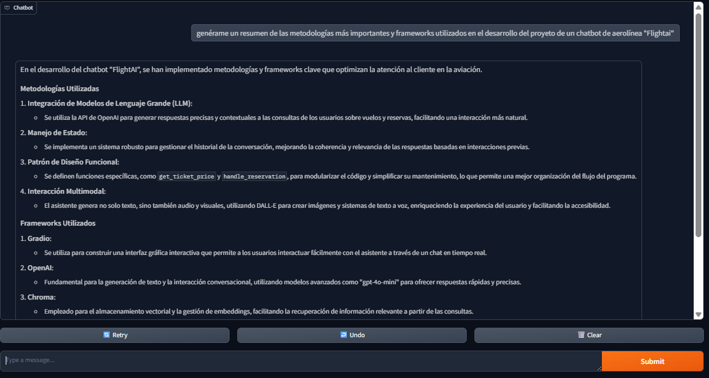
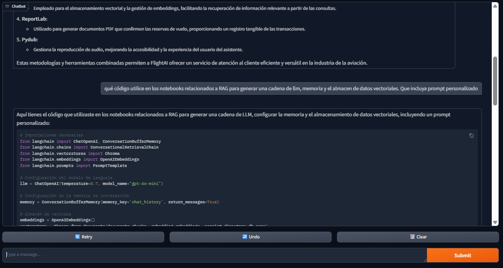
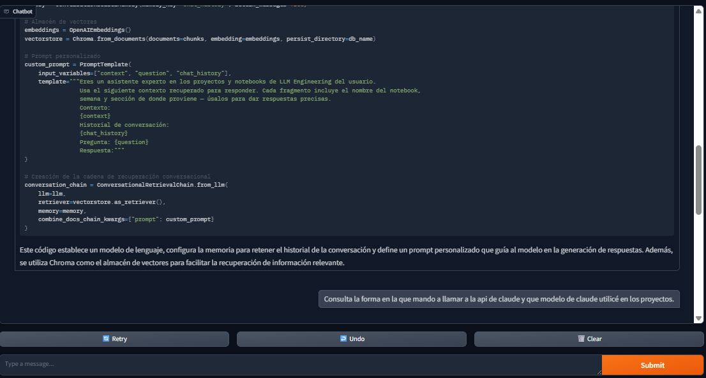
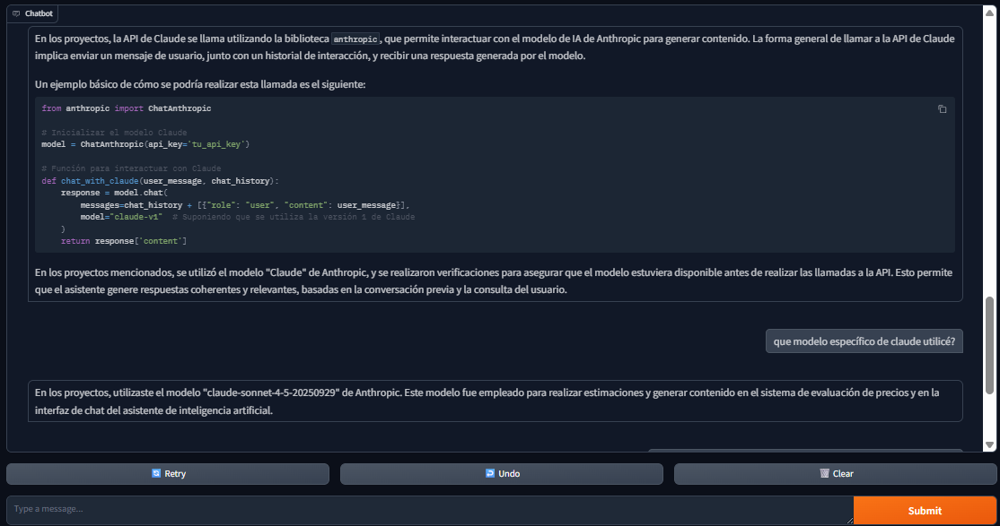
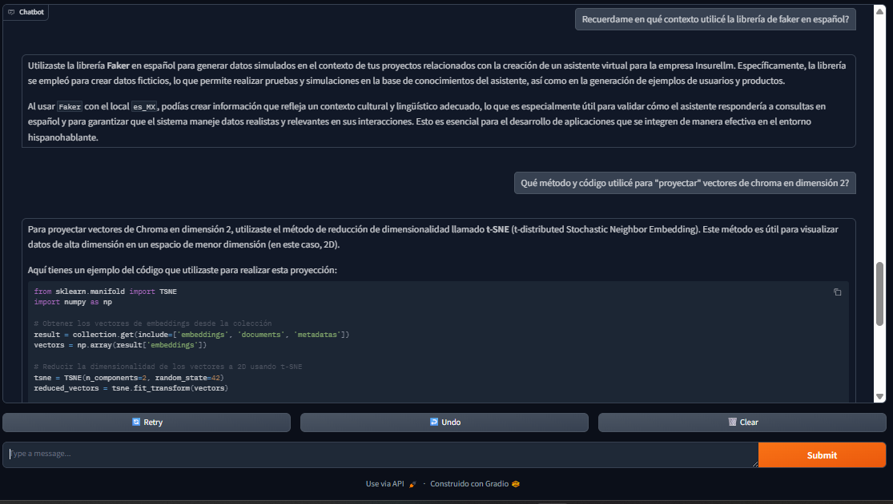
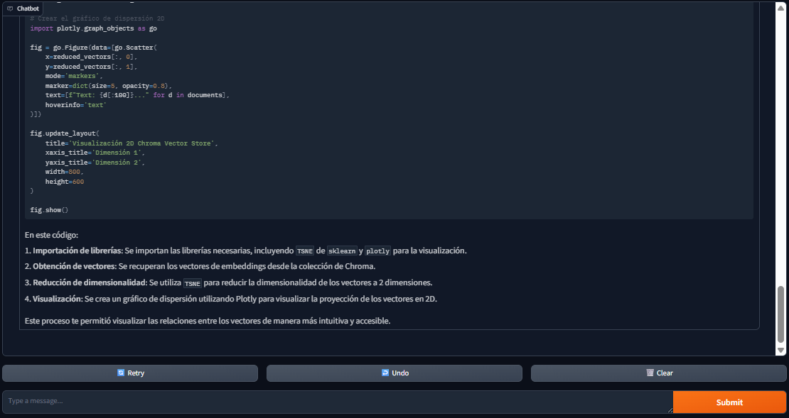

# Asistente RAG de Notebooks personales.
Chatbot con IA que responde preguntas sobre el código, técnicas y temas de 54 de mis notebooks con temas relacionados a LLM Engineering, usando recuperación semántica con chunking jerárquico y ChromaDB.

## Qué resuelve
Los notebooks tienen poca semántica: nombres ambiguos, fragmentos sin contexto y conocimiento implícito que los hace difíciles de consultar. Este proyecto convierte notebooks en una base de conocimiento consultable, permitiendo preguntas como "¿cómo se implementaron los embedding en cierto tema?" o "¿en qué notebook implementé function calling?", y obteniendo respuestas precisas con el fragmento de código y la referencia exacta al notebook.

## Funcionalidades
- Recuperacion semántica con dos niveles de granularidad: secciones de notebooks y summaries completos generados por LLM.
- Filtrado de calidad que descarta secciones sin suficiente contexto (solo codigo sin markdown o fragmentos demasiado cortos).
- Chat con memoria de conversacion y referencia explicita al notebook, semana y seccion de origen.
---

## Cómo funciona
El sistema aplica **hierarchical chunking** (parent-child retrieval): los documentos padre son summaries de cada notebook generados por GPT-4o-mini y cacheados en `summaries_cache.json`; los hijos son secciones individuales delimitadas por encabezados markdown. Cada chunk se enriquece con metadatos (semana, nombre del notebook, numero de celdas) antes de vectorizarse.

Los 281 documentos resultantes (227 secciones + 54 summaries) se almacenan en ChromaDB con embeddings de OpenAI de 1,536 dimensiones. ConversationalRetrievalChain recupera los chunks mas cercanos y los inyecta en un prompt personalizado junto con el historial del chat para responder con contexto acumulado.

### Arquitectura

```
Usuario
  |
  v
Gradio ChatInterface
  |
  v
ConversationalRetrievalChain  <---  ConversationBufferMemory
  |
  +---> Retriever (ChromaDB)
  |         |
  |         +-- Secciones de notebooks (227 docs)
  |         +-- Summaries LLM de notebooks (54 docs)
  |
  v
GPT-4o-mini  -->  Respuesta
```

## Stack tecnico
| | |
|---|---|
| **Lenguaje:** | Python 3.11 |
| **LLM / APIs:** | OpenAI GPT-4o-mini, OpenAI Embeddings (text-embedding-ada-002) |
| **Librerias clave:** | LangChain, ChromaDB, Gradio, Plotly, scikit-learn (t-SNE), python-dotenv |

## Correr localmente
```bash
# 1. Clonar
git clone URL_DE_TU_REPO
cd Proyecto_RAG

# 2. Crear y activar el ambiente
python -m venv .venv
.\.venv\Scripts\Activate.ps1     # Windows (PowerShell)
# source .venv/bin/activate        # macOS / Linux

# 3. Instalar dependencias
pip install -r requirements.txt

# 4. Configurar las API keys
copy .env.example .env            # Windows  (cp en macOS/Linux)
# luego edita .env con tu OPENAI_API_KEY real

# 5. Abrir el notebook
jupyter notebook RAG_notebooks.ipynb
```
Nota: la primera vez que se corre el notebook se generara `summaries_cache.json` con los summaries de los 54 notebooks (una llamada LLM por notebook). Las ejecuciones siguientes leen el cache sin costo adicional.

## Resultados / Ejemplos
<p>
  
   
   <br><br>
  
  
   <br><br>
  
  
   
</p>


## Qué aprendí
- Forma de trabajar con fragmentos de código en RAG con sus limitantes semánticas. En este proyecto se tuvo que decidir la definició óptima de "documento" a distintos niveles de granularidad, cuáles de ellos valían la pena y hacían sentido vectiorizar; así como aquellos que serían más útiles si su vector asociado provenía de una descripción previa generada por LLM.
- Uso del framework de LangChain y disernimiento sobre cuándo no se pueden implementar directamente librerías de LangChain (como por ejemplo el parseo de documentos en este caso) y generar reglas propias que atiendan de mejor manera las necesidades del problema.
- Medir costo-beneficio para decidir a cuántos documentos convenía generarles un summary con LLM, y guardar los summaries en JSON desde la primera ejecucion para evitar costos repetidos.
- Enriquecimiento de chunks con metadata para poder generar consultas a mayor detalle, por ejemplo: qué librerías de LLM se utilizaron para el proyecto de FlightAI? 
